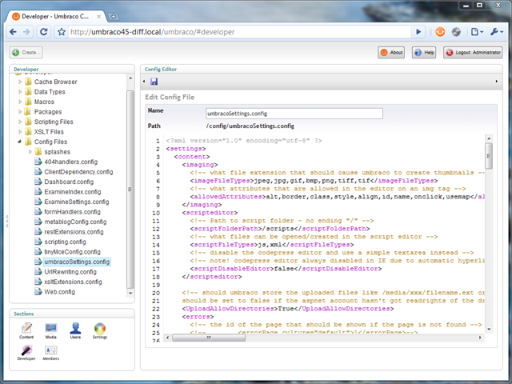

# Config Tree for Umbraco

This package will add a tree to the developer section called "Config Files". It will list all of the `*.config` files in your `~/config` folder.  These can all be modified in the editor provided.

The latest version of the package can be downloaded from the Our Umbraco community website: 
[http://our.umbraco.org/projects/developer-tools/config-tree](http://our.umbraco.org/projects/developer-tools/config-tree)

## Links

* Source: https://github.com/leekelleher/umbraco-config-tree
* Umbraco Package: http://our.umbraco.org/projects/developer-tools/config-tree
* Twitter: [@leekelleher](http://twitter.com/leekelleher)
* Twitter: [@timgeyssens](http://twitter.com/timgeyssens)
